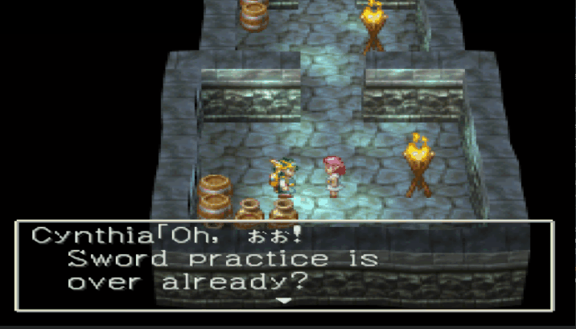
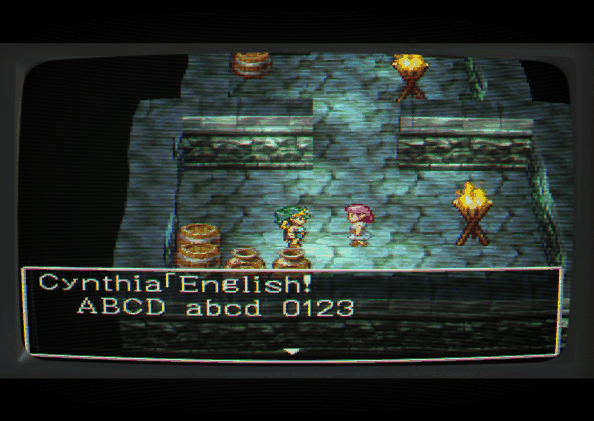
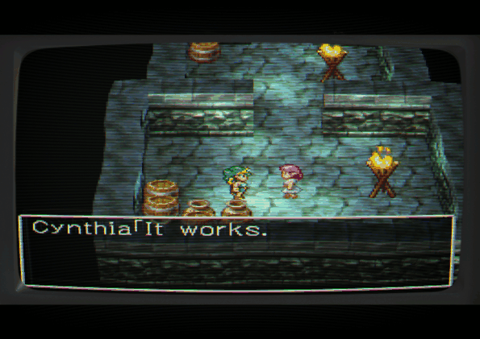

# DQIV_PSX_TOOLS

A read-only Python library for reading Dragon Quest IV on the PlayStation
(SLPM-86916): its archive container, its compressed text, its Huffman trees, its
phrase dictionaries, its sector table and its glyph atlas.

stdlib only. No dependencies. Reading is the bulk of it; there is also a build path
that writes a modified copy of a disc image, and it never writes to the source.

**No game data ships here.** You supply your own disc image.

**A whole scene renders in English from a disc built by this library.**



All eleven strings of text id 0x006C, the opening scene, translated and built by this
tooling, across 29 message boxes against the Japanese script's 21. Capitals, lowercase,
digits and punctuation all render, the letters are drawn from both 2-bit planes of the
atlas mixed inside the same word, and the player-entered name substitutes correctly
through the `0x7F1F` code, which is why a kana name sits inside an English line here: the
name entry screen has not been translated yet. Verified on hardware-accurate emulation
(DuckStation) on 2026-08-21.

The two earlier single-line proofs are still here:





No new glyphs and no font table changes were needed: the letters were already in the
game, and finding them meant correcting a published negative result of our own that
said they were not (FORMAT.md section 11).

The pipeline is demonstrated, not only gated. A disc rebuilt by this library from an
unmodified archive is byte-identical to its source, and boots. A disc carrying a
Huffman tree built by this library, replacing the one the game shipped, boots and
renders its scene correctly. So does a disc whose script sub-block was decompressed,
edited, recompressed and reassembled with every referrer into it rewritten.

## What this is for

Reading the format, and proving that the reading is right. Every claim the library
relies on is checked by a gate that runs against a real disc and prints the measured
value next to the expected one.

If you want to know how the format works, read **[FORMAT.md](FORMAT.md)**. It is the
single authoritative place for that, and every claim in it carries either the gate
number that proves it or an explicit INFERRED or UNKNOWN label. This README does not
repeat any of it.

## Layout

```
dq4/
  iso.py          raw disc image access
  hbd.py          archive block and sub-block access
  textblock.py    text sub-block header parsing
  huffman.py      Huffman decode and encode
  corpus.py       decoded corpus generator
  dictionary.py   phrase dictionary parse and expansion
  lzs.py          LZSS decompression
  lzs_comp.py     LZSS compression
  sectortable.py  level sector table access
  glyph.py        glyph atlas rendering
  fonts.py        the two font tables, reconstructed from the executable
  codes.py        control code table and census
verify.py         the gate suite
FORMAT.md         the format reference
```

## Running the gates

```
python verify.py --dq4 "path/to/Dragon Quest IV (Japan).bin"
```

Takes a couple of minutes, because it decodes and re-encodes every text sub-block on
the disc. Output is one line per gate with the measured value and the expected one.

Thirty nine gates cover source and output integrity, the block scan, the sub-block
census, sub-block alignment, the text header invariants, a known-good decode, a
byte-exact round trip, the dictionary, the sector table, the control code census, the
atlas geometry and its font table, LZS decompression, the STR video band, a MIPS
disassembler round trip, the four referrer systems, the bit budget, per-string
editability and the corpus roll-up hash.

Gate 1 asks whether the image is the pinned source disc. On a disc this library built
the answer is legitimately no, so it prints as a note rather than a verdict and gate 1b
carries the structural check. A modified disc still has an all-pass target.

Two of them, gates 9 and 10, exist because of a specific failure. A decoder that had
collapsed to a two-leaf tree passed the byte-exact round trip on 1,527 of 1,528 blocks,
because a degenerate tree round-trips any bitstream perfectly. Only the corpus bits per
symbol figure exposed it. **Any gate that can pass degenerately carries a companion, or
it does not ship.**

That was not the last time. Four separate defects have now passed every gate written
from our own model of the format, and each was caught only by a check derived from a
statistic the shipped game exhibits: bits per symbol, the LZS overrun distribution, a
20-kana companion, and a whole-archive alignment census. **A gate written from a model
tests the model.** If you reuse this library, add gates of the second kind first.
FORMAT.md section 16 is the short version and it is the most transferable thing here.

## The corpus and its roll-up hash

```
python -m dq4.corpus --disc "path/to/Dragon Quest IV (Japan).bin" --out corpus/
```

Regenerates the whole decoded corpus from scratch. **The output is a complete
decoded script of a copyrighted game and never belongs in a repository.** Both
repos ignore `corpus/` by name.

`MANIFEST.md` carries a single SHA-256 over the sorted per-file hashes. That one
value answers "did the decoder change" without rerunning a gate, and gate 22
checks it.

**The rule: after any library change, regenerate and diff. If the roll-up moves,
review the diff line by line before accepting the new value. Never accept a moved
hash by regenerating the expectation.** The expected hash lives in the library, in
`dq4/corpus.py`, not in the corpus, so the baseline cannot silently update itself.

The reason this exists: in Phase 1 a collapsed decoder passed the byte-exact round
trip on 1,527 of 1,528 blocks while producing entirely different text. Every gate
stayed green. A roll-up hash catches that class immediately.

## Using it

```python
import sys; sys.path.insert(0, "path/to/DQIV_PSX_TOOLS")
from dq4 import iso, hbd, textblock, huffman, dictionary

with iso.RawISO("Dragon Quest IV (Japan).bin") as disc:
    lba, size = disc.find("HBD1PS1D.Q41")
    archive = disc.extract(lba, size)

blocks = hbd.scan_blocks(archive)
for sector, sub in hbd.text_sub_blocks(blocks):
    raw = hbd.sub_bytes(archive, sub)
    tb = textblock.TextBlock(raw)
    tree = huffman.HuffmanTree(tb)
    symbols = tree.decode()
    phrases = dictionary.parse(raw, tb)
    expanded, unresolved = dictionary.expand(symbols, phrases)
    print(hex(tb.id), huffman.render(expanded)[:80])
```

## Credit

This is built on **Markus Schroeder's** documentation at markus-projects.net and on
**Mandy Wilkens's** control code table and compression identification. FORMAT.md opens
with a fuller acknowledgement, including which specific observation of Markus's made
the tree decodable at all.

## License

MIT. See `LICENSE`.

The license covers this library. It does not cover the game, and no game data is
included here.
